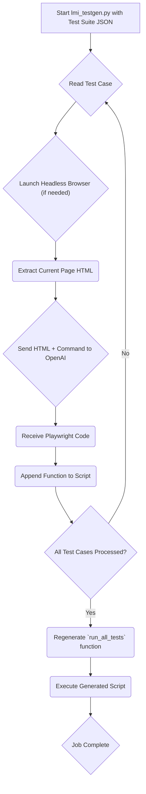
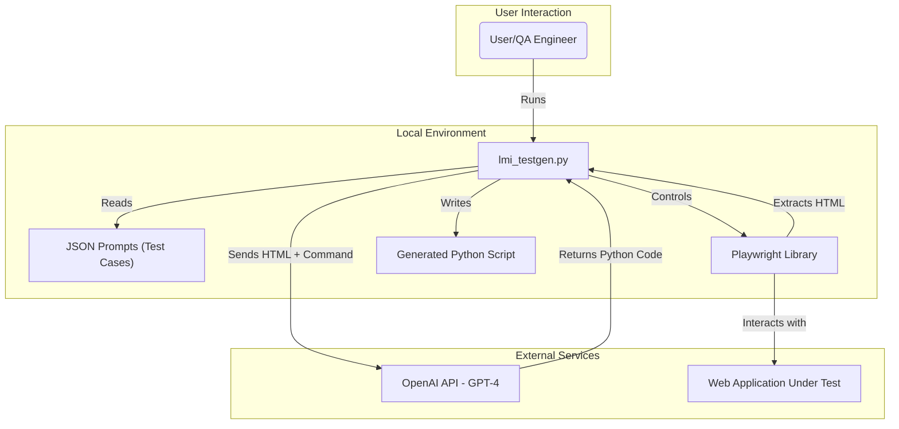
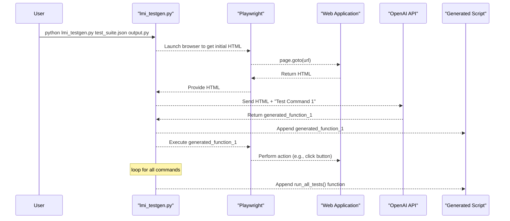

# Brizo-Main QA Automation Technical Documentation

## 1. Foundational Context

### Project Overview & Objective

Brizo-Main is a QA automation tool that leverages Natural Language Processing (NLP) to automatically generate Playwright Python test scripts from high-level, human-readable test cases. The core objective is to accelerate the QA process by allowing testers to define test suites in a simple JSON format, using natural language commands, which are then converted into executable test code. This eliminates the need for manual scripting of repetitive test scenarios and lowers the barrier to entry for creating automated tests.

### System Workflows

#### Test Generation Flow



1.  **Start Script:** The user runs `lmi_testgen.py`, providing a path to a test suite JSON file and an output script name.
2.  **Read Test Case:** The script iterates through each "node" (test case) in the JSON file.
3.  **Extract HTML:** For the current test step, the script fetches the relevant HTML of the web page. It prioritizes a cached `current_html.html` file for speed, but can launch a headless browser to get the live HTML if necessary.
4.  **Send to OpenAI:** The HTML content and the natural language command (e.g., "Type in 'Alonzo AI' in the search bar") are sent to the OpenAI GPT-4 API.
5.  **Receive Playwright Code:** OpenAI returns a Python function using the Playwright `sync_api` that implements the requested command.
6.  **Append to Script:** The generated function is cleaned and appended to the output Python script.
7.  **Execute and Cache:** The script immediately runs the newly generated function to validate it and to cache the resulting page HTML in `current_html.html` for the next step.
8.  **Regenerate `run_all_tests`:** After all nodes are processed, the script creates a `run_all_tests` function that calls all the individual test functions in the correct order.
9.  **Job Complete:** The final Python test script is ready to be used for full test runs.

### Architecture & Tech Stack

The engine is a command-line tool that orchestrates interactions between the local file system, a web browser, and the OpenAI API.



| Category          | Technology/Library | Description                                                                                             |
|-------------------|--------------------|---------------------------------------------------------------------------------------------------------|
| **Core Logic**    | Python             | The main scripting language for the tool.                                                               |
| **NLP Model**     | OpenAI GPT-4       | Used to translate natural language commands into Playwright code.                                       |
| **Browser Automation** | Playwright    | The framework used to interact with the web application under test and execute the generated steps.     |
| **Key Libraries** | `openai`           | The official Python client for the OpenAI API.                                                          |
|                   | `playwright`       | Provides the browser automation capabilities.                                                           |
|                   | `json`             | Used for reading the test suite and configuration files.                                                |

### High Level Diagram



### Core Concepts

*   **NLP-to-Code:** The central idea is to use a powerful language model to bridge the gap between a human-readable test plan and a functional automated script.
*   **Incremental Generation:** The script is built one function at a time. After each function is generated, it is immediately executed. This allows the state of the web page (and its HTML) to be captured and used as context for generating the next test step, making the process state-aware.
*   **State Caching:** The `current_html.html` file acts as a simple cache. This avoids re-launching the browser and navigating to the URL for every single step, speeding up the generation process significantly.

## 2. Practical Guides

### Setup and Installation

1.  **Prerequisites:**
    *   Python 3.9+
    *   An OpenAI API Key

2.  **Clone the repository and install dependencies:**
    ```bash
    git clone <repository-url>
    cd brizo-main
    python -m venv venv
    source venv/bin/activate
    pip install -r requirements.txt
    ```

3.  **Configure OpenAI API Key:**
    Create a file named `config.json` in the root directory with your OpenAI API key:
    ```json
    {
      "openai_api_key": "YOUR_OPENAI_API_KEY_HERE"
    }
    ```

4.  **Create a Test Suite:**
    Define your test cases in a JSON file inside the `test_suites/` directory. See the format description below.

5.  **Generate the test script:**
    ```bash
    python lmi_testgen.py test_suites/your_test_suite.json your_generated_script.py
    ```

6.  **Run the full generated test script:**
    ```bash
    python your_generated_script.py
    ```

## 3. Reference Material

### Command-Line Usage

```
python lmi_testgen.py <path_to_test_suite.json> <output_script_name.py>
```
*   **`path_to_test_suite.json`**: The input file containing the natural language test cases.
*   **`output_script_name.py`**: The name of the Python file to be generated.

### Test Suite Format

Test suites are JSON files with a `name` and a list of `nodes`. Each node represents a single step.

**Node Structure:**
*   `type`: "action" or "test".
    *   `action`: An interactive step (e.g., click, type, navigate).
    *   `test`: A verification step (e.g., check for text, verify an element exists).
*   `command`: A natural language string describing the step.

**Example (`test_suites/google_test.json`):**
```json
{
  "name": "Test Google",
  "nodes": [
    {
      "type": "action",
      "command": "Open https://www.google.com"
    },
    {
      "type": "action",
      "command": "Type in 'Alonzo AI' in the search bar"
    },
    {
      "type": "action",
      "command": "Press Enter"
    }
  ]
}
```

## 4. Operational and Quality Assurance

### Directory Structure

```
brizo-main/
├───current_html.html       # Cached HTML from the last test step
├───lmi_testgen.py          # The core script for test generation
├───README.md
├───requirements.txt
└───test_suites/
    ├───google_test.json    # Example test suite for Google
    └───lmi_demo.json       # Example test suite for the LMI demo site
```

### Code Structure

*   `lmi_testgen.py`: The main, monolithic script containing all logic.
    *   `call_openai_for_test_function()`: Handles the API call to OpenAI.
    *   `clean_generated_code()`: Sanitizes the code returned by the LLM.
    *   `extract_html_from_url()`: Fetches HTML from a URL using Playwright.
    *   `generate_function_from_test_node()`: Orchestrates the generation of a single test function.
    *   `main()`: The main execution loop that processes the test suite.
*   `test_suites/`: Contains JSON files that define the test steps.

### Error Handling & Logging

*   **Error Handling:** The script has basic error handling, such as timeouts for test execution (`subprocess.TimeoutExpired`) and warnings if files cannot be removed. However, it is not robust against malformed JSON or unexpected OpenAI API responses.
*   **Logging:** Logging is done via simple `print()` statements to the console, indicating the current step being generated, the source of HTML being used, and the success or failure of intermediate test runs. There is no formal logging framework in place.
