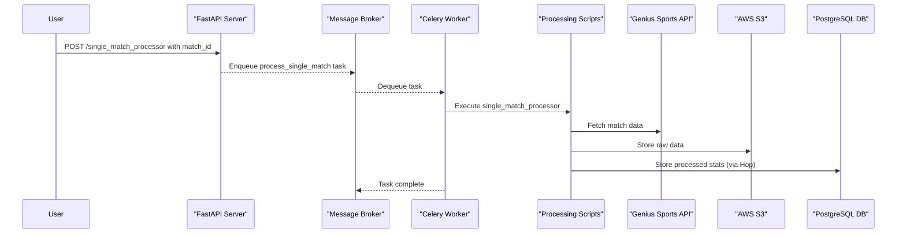
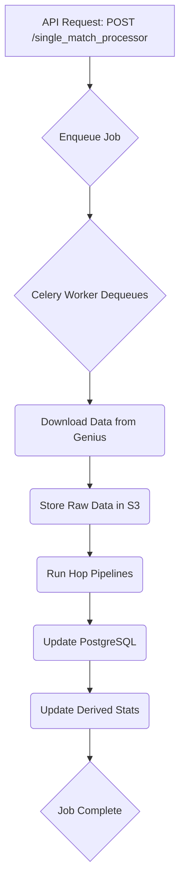

# Post-Game Workflow Engine Technical Documentation

## 1. Foundational Context

### Project Overview & Objective

The Post-Game Workflow Engine is a sophisticated data processing pipeline engineered to handle and analyze sports statistics, with a primary focus on American football and basketball. Its core objective is to automate the entire post-game data lifecycle: fetching raw data from the Genius Sports API, processing it through a series of configurable transformation pipelines, and storing the structured results in a PostgreSQL database. The system is designed for reliability and scalability, using an asynchronous task queue to manage long-running processes, ensuring that the API remains responsive and that data is processed efficiently.

### Architecture & Tech Stack

The engine is built on a decoupled, asynchronous architecture that separates the API from the heavy data processing tasks. This ensures that user-facing endpoints remain fast and available while complex computations are handled in the background.

```mermaid
graph TD
    subgraph "User Interaction"
        User[User/Client]
    end

    subgraph "Application Layer"
        FastAPI[FastAPI Server<br>(api/ScriptsAPI.py)]
        Broker[Message Broker<br>(Redis/RabbitMQ)]
        Celery[Celery Worker<br>(api/celery_worker.py)]
    end

    subgraph "Processing Logic"
        Scripts[Processing Scripts<br>(scripts/)]
    end

    subgraph "External Services & Data Stores"
        Genius[Genius Sports API]
        S3[AWS S3 Bucket]
        Postgres[PostgreSQL Database]
        Hop[Hop Orchestrator]
    end

    User -- HTTP Request --> FastAPI
    FastAPI -- Enqueues Job --> Broker
    Celery -- Dequeues Job --> Broker
    Celery -- Executes --> Scripts
    Scripts -- Fetches Data --> Genius
    Scripts -- Stores/Retrieves Raw Data --> S3
    Scripts -- Runs Pipelines --> Hop
    Scripts -- Reads/Writes Processed Data --> Postgres
```

| Category          | Technology/Library | Description                                                                                             |
|-------------------|--------------------|---------------------------------------------------------------------------------------------------------|
| **Backend**       | FastAPI            | A high-performance Python web framework for building the main API.                                      |
|                   | Celery             | A distributed task queue for running asynchronous data processing jobs in the background.               |
|                   | PostgreSQL         | The primary relational database for storing all raw, processed, and derived sports statistics.          |
|                   | AWS S3             | Used as an object store for raw data files downloaded from the Genius Sports API.                       |
|                   | Hop Orchestrator   | A data orchestration tool used to execute complex data transformation pipelines defined in `.hpl` files. |
| **Key Libraries** | `uvicorn`          | ASGI server for running the FastAPI application.                                                        |
|                   | `psycopg2-binary`  | A PostgreSQL adapter for Python.                                                                        |
|                   | `boto3`            | The AWS SDK for Python, used for interacting with S3.                                                   |
|                   | `pydantic`         | For data validation and settings management in FastAPI.                                                 |
|                   | `slack_sdk`        | For sending notifications to Slack channels.                                                            |

### High Level Diagram



### Core Concepts

*   **Asynchronous Processing:** The system offloads time-consuming tasks (like API calls and data transformations) to a Celery worker. The main FastAPI application remains non-blocking and can quickly respond to user requests by returning a `job_id`.
*   **Workflow Orchestration:** The `Orchestrator` module (`scripts/Orchestrator`) reads pipeline sequences from JSON configuration files. This allows developers to define and modify data processing workflows without changing the core application logic.
*   **Hop Pipelines:** Data transformation logic is encapsulated in Hop pipelines (`.hpl` files). These pipelines are executed by the Hop Orchestrator and are responsible for tasks like data cleaning, aggregation, and reshaping.
*   **Single Match vs. Season Data:** The system has distinct workflows for processing the detailed statistics of a single game versus processing high-level, season-wide data. This separation allows for both deep analysis and broad updates.

## 2. Practical Guides

### Setup and Installation

1.  **Prerequisites:**
    *   Python 3.13+
    *   PostgreSQL
    *   An AWS account with a configured S3 bucket
    *   Access to the Genius Sports API
    *   A message broker (e.g., Redis, RabbitMQ) for Celery.

2.  **Clone the repository:**
    ```bash
    git clone <repository-url>
    cd PostGameWorkflow-main
    ```

3.  **Install dependencies:**
    ```bash
    pip install uv
    uv pip install -r requirements.in
    ```

4.  **Configure environment variables:**
    Create a file named `environment-variables.json` in the `config/` directory with your credentials:
    ```json
    {
      "PG_HOST": "localhost",
      "PG_PORT": 5432,
      "PG_USERNAME": "your_db_user",
      "PG_PASSWORD": "your_db_password",
      "PG_DATABASE": "your_db_name",
      "AWS_ACCESS_KEY_ID": "your_aws_access_key",
      "AWS_SECRET_ACCESS_KEY": "your_aws_secret_key",
      "AWS_REGION": "us-east-1",
      "S3_BUCKET": "your-s3-bucket-name",
      "API_BASE_URL": "http://localhost:8000",
      "HOP_RUN_PATH": "/path/to/hop/hop-run.sh",
      "HOP_PROJECT": "YourHopProject",
      "SLACK_BOT_TOKEN": "YOUR_SLACK_BOT_TOKEN_HERE",
      "DEFAULT_CHANNEL": "YOUR_DEFAULT_CHANNEL_HERE"
    }
    ```

5.  **Run the application:**
    *   **Start the FastAPI Server:**
        ```bash
        uvicorn api.ScriptsAPI:app --reload --port 8000
        ```
    *   **Start the Celery Worker:**
        ```bash
        celery -A api.celery_worker.celery_app worker --loglevel=info
        ```

### System Workflows

#### Single Match Processing Flow



1.  **API Request:** A user sends a `POST` request to `/single_match_processor` with a `match_id` and `competition_id`.
2.  **Enqueue Job:** The FastAPI server creates a Celery task and returns a `job_id` to the user.
3.  **Download Data:** The Celery worker executes the `single_match_processor_api.py` script, which calls the Genius Sports API to fetch game data.
4.  **Store Raw Data:** The raw JSON/XML data is uploaded to an AWS S3 bucket for archival and debugging.
5.  **Run Hop Pipelines:** The orchestrator executes a sequence of Hop pipelines (`.hpl` files) to process game statistics (e.g., `PGS_Construction.hpl`, `TGS_Construction.hpl`).
6.  **Update PostgreSQL:** The pipelines write the transformed data into the appropriate tables in the PostgreSQL database.
7.  **Update Derived Stats:** After game-level data is processed, the system triggers updates for derived statistics, such as player season and career totals.
8.  **Job Complete:** The status of the job is updated to "SUCCESS".

## 3. Reference Material

### API Reference

| Endpoint                      | Method | Description                                      | Authentication |
| ----------------------------- | ------ | ------------------------------------------------ | -------------- |
| `/single_match_processor`     | POST   | Initiate a full processing workflow for a single match. | None           |
| `/season_data_processor`      | POST   | Process high-level data for an entire season.    | None           |
| `/single_match_processor/job/{job_id}` | GET    | Check the status and result of a job.            | None           |
| `/season_data_processor/job/{job_id}`  | GET    | Check the status and result of a job.            | None           |

### Data Model & Mappings

*   **Database Schema:** The database schema is designed to store sports data in a structured format. Key tables include:
    *   `mfb_matches`: Stores match-level information.
    *   `mfb_persons`: Stores information about players.
    *   `mfb_team_match`: A linking table for teams and matches.
    *   Statistics tables for player/team game, season, and career stats.
*   **Configuration Files:**
    *   `config/migrator_config.json`: Defines settings for the S3 to PostgreSQL migrator.
    *   `config/migration_config/*.yaml`: YAML files defining the schema and data types for various tables.
    *   `scripts/Orchestrator/workflows.json`: Defines the sequence of scripts and pipelines to be run for different workflows.
    *   `scripts/Orchestrator/Pipelines/MFB/.../pipeline_sequences.json`: Defines the sequence of Hop pipelines for a specific part of the workflow.

### Request/Response Payloads

#### Single Match Request

```json
{
  "match_id": "12345",
  "competition_id": 14
}
```

#### Job Status Response

```json
{
    "job_id": "a1b2c3d4-e5f6-g7h8-i9j0-k1l2m3n4o5p6",
    "status": "SUCCESS",
    "ready": true,
    "result": {
        "success": true,
        "message": "Processing completed successfully"
    }
}
```

## 4. Operational and Quality Assurance

### Code Structure

The project is organized into several key directories:

*   `api/`: Contains the FastAPI server, Celery worker, and API-related configurations.
*   `config/`: Holds all configuration files, including database connections, migrator settings, and helper scripts.
*   `scripts/`: The core of the application, containing all data processing scripts, the orchestrator, and Hop pipeline definitions.
    *   `GeniusToS3Download/`: Scripts for downloading data from the Genius Sports API.
    *   `Orchestrator/`: The workflow orchestration engine.
    *   `Orchestrator/Pipelines/`: Contains the Hop pipeline files (`.hpl`) and sequence definitions.
*   `main.py`: The main entry point for the application (currently a placeholder).
*   `requirements.in`: A list of Python dependencies for the project.

### Directory Structure

```
C:.
├───.gitignore
├───README.md
├───documentation.txt
├───main.py
├───post_game_api.service
├───post_game_celery.service
├───pyproject.toml
├───requirements.in
├───season_data_processor.py
├───single_match_processor.py
├───uv.lock
├───api/
│   ├───celery_config.py
│   ├───celery_worker.py
│   ├───script_paths.json
│   └───ScriptsAPI.py
├───config/
│   ├───__init__.py
│   ├───migrator_config.json
│   ├───helper_scripts/
│   │   ├───__init__.py
│   │   ├───logging_mixin.py
│   │   └───matches_helper.py
│   └───migration_config/
│       ├───mfb_matches.yaml
│       ├───mfb_person_match.yaml
│       ├───mfb_persons.yaml
│       └───mfb_team_match.yaml
└───scripts/
    ├───add_usability_fields.py
    ├───copy_s3_data.py
    ├───delete_and_merge_postgres.py
    ├───delete_from_postgres.py
    ├───dump_to_s3.py
    ├───fetch_games.py
    ├───get_player_ids.py
    ├───get_table_list.py
    ├───match_table_creator.py
    ├───merge_postgres_tables.py
    ├───pivot_table_creator.py
    ├───postgres_views.py
    ├───roster_processor_api.py
    ├───s3_to_postgres_migrator.py
    ├───season_data_processor_api.py
    ├───single_match_processor_api.py
    ├───slack_notifier.py
    ├───GeniusToS3Download/
    │   ├───__init__.py
    │   ├───GeniusToS3Download.py
    │   └───resources/
    │       ├───american_football_api.json
    │       └───basketball_api.json
    └───Orchestrator/
        ├───__init__.py
        ├───orchestrator.py
        ├───RunPipelines.py
        ├───workflows.json
        └───Pipelines/
            └───MFB/
                ├───ActiveRoster/
                ├───FlatMatch/
                ├───PlayerCareerStatistics/
                ├───PlayerGameStatistics/
                ├───PlayerSeasonStatistics/
                ├───TeamGameStatistics/
                └───TeamSeasonStatistics/
```

### Testing & Validation

*   **Testing:** The project currently lacks a dedicated testing suite (`tests/` directory). Implementing unit and integration tests for the API endpoints, processing scripts, and orchestrator logic would be a critical next step to ensure reliability.
*   **Validation:** FastAPI uses Pydantic models to validate incoming request data, ensuring that all API calls have the correct data types and required fields before processing begins.

### Error Handling & Logging

*   **Error Handling:** The Celery tasks and processing scripts should include robust error handling to manage potential issues like API failures, database connection errors, or data transformation problems. The status of a job is updated to "FAILURE" if an unhandled exception occurs.
*   **Logging:** The `logging_mixin.py` in `config/helper_scripts/` provides a standardized way to incorporate logging into different parts of the application. This allows for consistent and centralized logging, which is crucial for debugging and monitoring the workflow engine.
