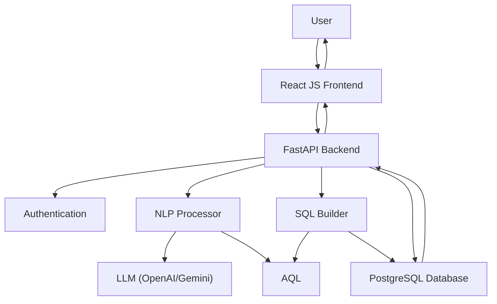
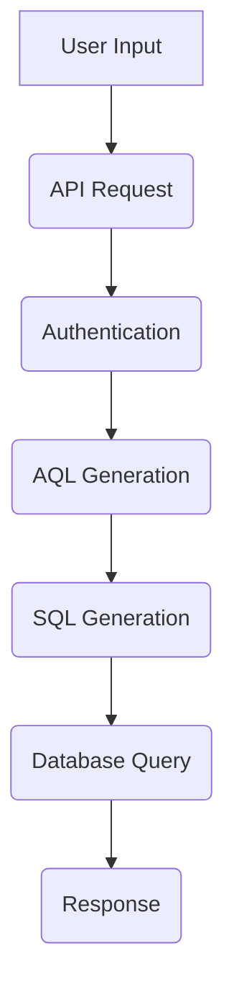

# Search Technical Documentation

## 1. Foundational Context

### Project Overview & Objective

The Search is a sophisticated sports analytics platform designed to provide users with a powerful and intuitive interface for querying a vast repository of sports data. The primary objective of the Search is to translate complex natural language queries into precise, structured database queries, enabling users to retrieve detailed statistics, records, and insights without needing to know the underlying database schema or SQL. The system is built to be fast, scalable, and extensible, supporting multiple sports and a wide range of analytical queries.

### Architecture & Tech Stack

The Search is built on a modern, decoupled architecture, with a Python-based backend and a presumed React JS frontend.



*   **Backend:**
    *   **Framework:** FastAPI, a high-performance Python web framework for building APIs.
    *   **Database:** PostgreSQL, a powerful open-source object-relational database system. It is used for storing all sports data, user information, and application state.
    *   **Natural Language Processing:** Large Language Models (LLMs) like OpenAI's GPT series and Google's Gemini are used to convert natural language queries into a structured format (AQL).
    *   **Authentication:** JWT (JSON Web Tokens) are used for securing API endpoints.
    *   **ORM/Database Interaction:** The system uses a combination of direct SQL queries and a custom `PGSQLAdapter` for interacting with the PostgreSQL database.

*   **Frontend (Inferred):**
    *   **Framework:** React JS (inferred from CORS settings), a popular JavaScript library for building user interfaces.

*   **Key Libraries:**
    *   `psycopg2-binary`: For connecting to the PostgreSQL database.
    *   `fastapi`: The core web framework.
    *   `uvicorn`: ASGI server for running the FastAPI application.
    *   `pydantic`: For data validation and settings management.
    *   `passlib`, `bcrypt`, `PyJWT`: For password hashing and JWT authentication.
    *   `folioprompts`: For version-controlling prompts sent to LLMs.
    *   `sentence-transformers`: For semantic search and embedding generation.
    *   `pandas`: For data manipulation and CSV export.

### High Level Diagram

```mermaid
sequenceDiagram
    participant User
    participant Frontend
    participant "FastAPI Backend"
    participant "NLP Processor"
    participant LLM
    participant "SQL Builder"
    participant "PostgreSQL DB"

    User->>Frontend: Enters NLQ and clicks search
    Frontend->>"FastAPI Backend": POST /api/search with NLQ
    "FastAPI Backend"->>"NLP Processor": Converts NLQ to AQL
    "NLP Processor"->>LLM: Generates AQL from NLQ
    LLM-->>"NLP Processor": Returns AQL
    "NLP Processor"-->>"FastAPI Backend": Returns AQL
    "FastAPI Backend"->>"SQL Builder": Converts AQL to SQL
    "SQL Builder"->>"PostgreSQL DB": Executes SQL query
    "PostgreSQL DB"-->>"SQL Builder": Returns query results
    "SQL Builder"-->>"FastAPI Backend": Returns results
    "FastAPI Backend"-->>Frontend: Returns JSON response
    Frontend-->>User: Displays results
```



### Core Concepts

*   **AQL (Athlyte Query Language):** AQL is a proprietary, JSON-based structured language that serves as an intermediate representation of a user's query. It is generated by the LLM from the user's natural language input. AQL standardizes the query's intent, including the statistics, conditions, and filters, before it is translated into SQL. This abstraction layer allows the system to support different database backends and query types without changing the core NLP logic.

    *   **Example AQL:**
        ```json
        {
          "conditions": "s_rushing_yards > 100",
          "qualifiers": {
            "team_name": "Alabama"
          },
          "stat_period": "game",
          "query_type": "basic"
        }
        ```

## 2. Practical Guides

### Setup and Installation

1.  **Prerequisites:**
    *   Python 3.9+
    *   PostgreSQL database
    *   An environment with the necessary API keys for the LLMs (e.g., OpenAI, Google AI).

2.  **Clone the repository:**
    ```bash
    git clone <repository-url>
    cd R2_API
    ```

3.  **Install dependencies:**
    ```bash
    pip install -r requirements.txt
    ```

4.  **Configure environment variables:**
    Create a `.env` file in the root directory and add the following variables:
    ```
    DB_USER=<your_db_user>
    DB_PASSWORD=<your_db_password>
    DB_HOST=<your_db_host>
    DB_PORT=<your_db_port>
    DB_NAME=<your_db_name>
    SECRET_KEY=<your_jwt_secret_key>
    ALGORITHM=<your_jwt_algorithm>
    ACCESS_TOKEN_EXPIRE_MINUTES=<token_expiry_time>
    OPENAI_API_KEY=<your_openai_api_key>
    GOOGLE_API_KEY=<your_google_api_key>
    ```

5.  **Run the application:**
    ```bash
    uvicorn main:app --reload
    ```
    The API will be available at `http://127.0.0.1:8000`.

### System Workflows

#### NL Query Processing Flow



1.  **User Input:** The user enters a natural language query into the frontend (e.g., "Which player had the most rushing yards in a game last season?").

2.  **API Request:** The frontend sends a POST request to the `/api/search` endpoint with the query, sport, entity, and other parameters.

3.  **Authentication:** The `verify_token` dependency checks for a valid JWT in the request headers.

4.  **AQL Generation (`NlpProcessor`):**
    *   The `NlpProcessor` takes the natural language query.
    *   It retrieves relevant context, such as team information and statistical mappings.
    *   It uses a prompt from `folioprompts` to construct a detailed request for the selected LLM.
    *   The LLM processes the prompt and returns a structured AQL JSON object.

5.  **SQL Generation (`SQLBuilder`):**
    *   The `SQLBuilder` receives the AQL output.
    *   It identifies the correct database table based on the sport, entity, and stat period.
    *   It constructs a SQL query from the AQL's conditions, qualifiers, and query type. It uses SQL templates for different query types (basic, min, max, streak, etc.).

6.  **Database Query (`PGSQLAdapter`):**
    *   The `PGSQLAdapter` executes the generated SQL query against the PostgreSQL database.
    *   It fetches the results and the total count of records.

7.  **Response:** The API returns a JSON response containing the query results, total count, the generated AQL and SQL, and other metadata.

### User Guides (Modules)

#### Using the Search API

The primary way to interact with the R2 API is through the `/api/search` endpoint.

*   **Endpoint:** `POST /api/search`
*   **Authentication:** Requires a valid JWT.
*   **Request Body:**
    *   `BasicQuery`: The natural language query.
    *   `SportCode`: The sport to search within (e.g., "MFB", "MBB").
    *   `Entity`: The entity to search for ("Player" or "Team").
    *   `TeamCode`: The user's team code.
    *   `PageNumber`, `PageSize`: For pagination.
    *   `SortBy`, `SortOrder`: For sorting results.
    *   `Filters`: A dictionary of additional filters.
*   **Response:** A `SearchResponse` object containing the results, AQL, SQL, and filter options.

#### Admin Dashboard

The admin dashboard is accessible through the `/api/admin/*` endpoints. These endpoints are protected and require admin privileges.

*   **Functionality:**
    *   User management (listing, approving, rejecting users).
    *   Viewing system statistics.
    *   Onboarding new teams.

## 3. Reference Material

### API Reference

A summary of the main API endpoints.

| Endpoint                      | Method | Description                                      | Authentication |
| ----------------------------- | ------ | ------------------------------------------------ | -------------- |
| `/auth/register`              | POST   | Register a new user.                             | None           |
| `/auth/login`                 | POST   | Authenticate and receive a JWT.                  | None           |
| `/api/search`                 | POST   | Perform a natural language search.               | User           |
| `/api/export`                 | POST   | Export search results to a CSV file.             | User           |
| `/api/name-suggestions`       | POST   | Get auto-complete suggestions for names.         | None           |
| `/api/admin/users`            | GET    | List all users.                                  | Admin          |
| `/api/admin/approve-user`     | POST   | Approve a pending user.                          | Admin          |
| `/api/player-dashboard/{id}`  | GET    | Get a player's dashboard information.            | User           |
| `/api/game-dashboard/{id}`    | GET    | Get a game's dashboard information.              | User           |

### Data Model & Mappings

*   **Database Schema:** The database schema is not fully detailed in the provided code, but it can be inferred that there are tables for:
    *   `users`: Stores user information, including credentials and roles.
    *   `teams`: Stores team information.
    *   `active_roster`: Stores player information.
    *   `stat_mapping`: Maps user-friendly stat names to database column names.
    *   Sport-specific tables for game and season stats (e.g., `..._game_stats_player`, `..._season_stats_team`).

*   **Stat Mappings:** The `app/data_config/mappings` directory contains JSON files that define how stats, fields, and filters are mapped to database columns. The `mappings_handler.py` loads these mappings at runtime.

### Request/Response Payloads

#### Search Request

```json
{
  "BasicQuery": "most passing yards in a game",
  "SportCode": "MFB",
  "Entity": "Player",
  "TeamCode": "123",
  "PageNumber": 1,
  "PageSize": 10,
  "SortBy": "s_passing_yards",
  "SortOrder": "DESC",
  "Filters": {
    "season": ["2023"]
  },
  "UseRAG": true,
  "AQLOnly": false
}
```

#### Search Response

```json
{
  "count": 1,
  "results": [
    {
      "metadata": {
        "player_name": "John Doe",
        "team_name": "Example University",
        "game_date": "2023-10-28"
      },
      "stats": {
        "s_passing_yards": 520
      }
    }
  ],
  "aql_output": {
    "conditions": "s_passing_yards > 0",
    "qualifiers": {},
    "stat_period": "game",
    "query_type": "max"
  },
  "sql_query": "SELECT ... FROM ... WHERE ...",
  "inference_time": 1.2,
  "query_execution_time": 0.5,
  "mongo_execution_time": 0.1,
  "positions": ["QB", "WR"],
  "classes": ["FR", "SO"],
  "teams": ["Team A", "Team B"],
  "conferences": ["Conf A", "Conf B"],
  "game_type": ["Regular", "Post Season"],
  "period_type": ["Regular", "Overtime"]
}
```

## 4. Operational and Quality Assurance

### Code Structure

The codebase is organized into the following main directories:

*   `app/`: The main application directory.
    *   `api/`: Contains the API routes, middleware, and authentication logic.
    *   `data_config/`: Configuration files for data mappings.
    *   `db/`: Database connection handling, adapters, and handlers.
    *   `llms/`: Connectors for different Large Language Models.
    *   `models/`: Pydantic models for request and response validation.
    *   `services/`: Business logic for NLP processing, SQL building, etc.
    *   `sql_templates/`: SQL query templates.
    *   `utils/`: Utility functions, such as error handlers.
*   `tests/`: Unit and integration tests.
*   `main.py`: The main entry point for the FastAPI application.
*   `requirements.txt`: A list of Python dependencies.

### Directory Structure

```
C:.
├───.git
│   ├───hooks
│   ├───info
│   ├───logs
│   │   └───refs
│   │       ├───heads
│   │       └───remotes
│   │           └───origin
│   ├───objects
│   │   ├───info
│   │   └───pack
│   └───refs
│       ├───heads
│       ├───remotes
│       │   └───origin
│       └───tags
├───.github
│   └───workflows
│       ├───dev.yml
│       └───pilot.yml
├───app
│   ├───api
│   │   ├───middleware
│   │   │   └───admin_auth.py
│   │   ├───routes
│   │   │   ├───__init__.py
│   │   │   ├───admin.py
│   │   │   ├───auth.py
│   │   │   ├───game_dashboard.py
│   │   │   ├───login_issue.py
│   │   │   ├───player_dashboard.py
│   │   │   ├───report.py
│   │   │   ├───search.py
│   │   │   └───team_dashboard.py
│   │   └───__pycache__
│   │       └───__init__.cpython-311.pyc
│   ├───data_config
│   │   ├───mappings
│   │   │   ├───conference_mapping
│   │   │   ├───stat_mapping
│   │   │   ├───__init__.py
│   │   │   ├───division_mapping.json
│   │   │   ├───fields_mapping.json
│   │   │   ├───filter_mappings.json
│   │   │   ├───mappings_handler.py
│   │   │   ├───metadata_mapping.json
│   │   │   ├───pos_mapping.json
│   │   │   └───table_mapping.json
│   │   ├───query_samples
│   │   │   ├───MBB
│   │   │   ├───MFB
│   │   │   └───WBB
│   │   └───__pycache__
│   │       └───__init__.cpython-311.pyc
│   ├───db
│   │   ├───__init__.py
│   │   ├───admin_adapter.py
│   │   ├───auth_adapter.py
│   │   ├───connection.py
│   │   ├───dependencies.py
│   │   ├───fuzzy_logic.py
│   │   ├───gameDashboard.py
│   │   ├───mongo_connection.py
│   │   ├───pgsql_adapter.py
│   │   ├───playerDashboard.py
│   │   ├───postgres_connection.py
│   │   ├───postgres_handler.py
│   │   └───team_code.py
│   ├───docs
│   │   ├───documentation
│   │   │   ├───api
│   │   │   ├───data_config
│   │   │   ├───db
│   │   │   ├───llms
│   │   │   ├───models
│   │   │   ├───services
│   │   │   ├───sql_templates
│   │   │   └───utils
│   │   ├───Files.md
│   │   ├───generate_docs.py
│   │   └───README.md
│   ├───llms
│   │   ├───__init__.py
│   │   ├───base.py
│   │   ├───gemini_connector.py
│   │   ├───groq_connector.py
│   │   └───openai_connector.py
│   ├───ml_assets
│   │   ├───MBB
│   │   │   ├───Player.index
│   │   │   └───Team.index
│   │   ├───MFB
│   │   │   ├───Player.index
│   │   │   └───Team.index
│   │   └───WBB
│   │       ├───Player.index
│   │       └───Team.index
│   ├───models
│   │   ├───admin_models.py
│   │   ├───auth_models.py
│   │   ├───game_dashboard_models.py
│   │   ├───issue_models.py
│   │   ├───login_issue_models.py
│   │   ├───player_dashboard_models.py
│   │   ├───report_models.py
│   │   └───search_models.py
│   ├───services
│   │   ├───__init__.py
│   │   ├───hubspot_service.py
│   │   ├───mail_service.py
│   │   ├───nlp_processor.py
│   │   ├───password_generator.py
│   │   ├───sql_builder.py
│   │   └───stat_matcher.py
│   ├───sql_templates
│   │   ├───admin
│   │   │   ├───allteams.sql
│   │   │   ├───approve_user.sql
││   │   ├───approveOnboarding.sql
│   │   │   ├───college_requests.sql
│   │   │   ├───create_user.sql
│   │   │   ├───generateAdminPasswordResetToken.sql
│   │   │   ├───getSports.sql
│   │   │   ├───getTeamDetails.sql
│   │   │   ├───list_users.sql
│   │   │   ├───onboard_team.sql
│   │   │   ├───pending_users.sql
│   │   │   ├───recent_users.sql
│   │   │   ├───reject_user.sql
│   │   │   ├───search_users.sql
│   │   │   ├───stats.sql
│   │   │   ├───team_requests.sql
│   │   │   ├───update_user_with_password.sql
│   │   │   ├───update_user.sql
│   │   │   └───updateUserPassword.sql
│   │   ├───auth
│   │   │   ├───checkUserExists.sql
│   │   │   ├───generatePasswordResetToken.sql
│   │   │   ├───login.sql
│   │   │   ├───register.sql
│   │   │   ├───teams.sql
│   │   │   ├───updatePassword.sql
│   │   │   └───updateTermsAgreed.sql
│   │   ├───fuzzyMatch
│   │   │   └───MFB
│   │   ├───GameDashboard
│   │   │   ├───MBB
│   │   │   ├───MFB
│   │   │   └───WBB
│   │   ├───Highs
│   │   │   ├───MBB
│   │   │   ├───MFB
│   │   │   └───WBB
│   │   ├───Profile
│   │   │   ├───MBB
│   │   │   ├───MFB
│   │   │   └───WBB
│   │   ├───Records
│   │   │   ├───MBB
│   │   │   ├───MFB
│   │   │   └───WBB
│   │   └───Streaks
│   │       ├───MBB
│   │       ├───MFB
│   │       └───WBB
│   │   ├───basic.sql
│   │   ├───ltw.sql
│   │   ├───max.sql
│   │   ├───min.sql
│   │   ├───new_tables_for_user_register.sql
│   │   ├───sql_template_loader.py
│   │   ├───streak_mbb_player.sql
│   │   ├───streak_mbb_team.sql
│   │   ├───streak_mfb_player.sql
│   │   ├───streak_mfb_team.sql
│   │   ├───streak_wbb_player.sql
│   │   ├───streak_wbb_team.sql
│   │   └───streak.sql
│   ├───utils
│   │   └───error_handler.py
│   └───__pycache__
│       └───__init__.cpython-311.pyc
├───folio
│   ├───prompts
│   │   └───nlp_query_conversion
│   └───folio.db
├───tests
│   ├───app
│   │   ├───data_config
│   │   ├───db
│   │   └───services
│   ├───__init__.py
│   └───conftest.py
├───.gitignore
├───encode.py
├───Fastapi_NL_Search_Pipeline.png
├───main.py
├───README.md
├───requirements.txt
└───roster_import.py
```

### Testing & Validation

*   **Framework:** The project uses `pytest` for testing, including `pytest-asyncio` for testing asynchronous code and `httpx` for making HTTP requests to the API in tests.
*   **Test Structure:** Tests are located in the `tests/` directory and mirror the structure of the `app/` directory.
*   **Validation:** Pydantic models are used extensively for validating incoming request data and formatting outgoing response data, ensuring data integrity throughout the API.

### Error Handling & Logging

*   **Error Handling:** The application uses FastAPI's exception handling mechanism. Custom exception handlers can be found in `app/utils/error_handler.py`. Specific errors, such as database errors or LLM API errors, are caught in their respective modules and re-raised as `HTTPException` with appropriate status codes and details.
*   **Logging:** The application uses Python's built-in `logging` module. Logging is configured in the `app/api/routes/search.py` module to log information about incoming requests, generated queries, and any errors that occur. This allows for effective debugging and monitoring of the application.
