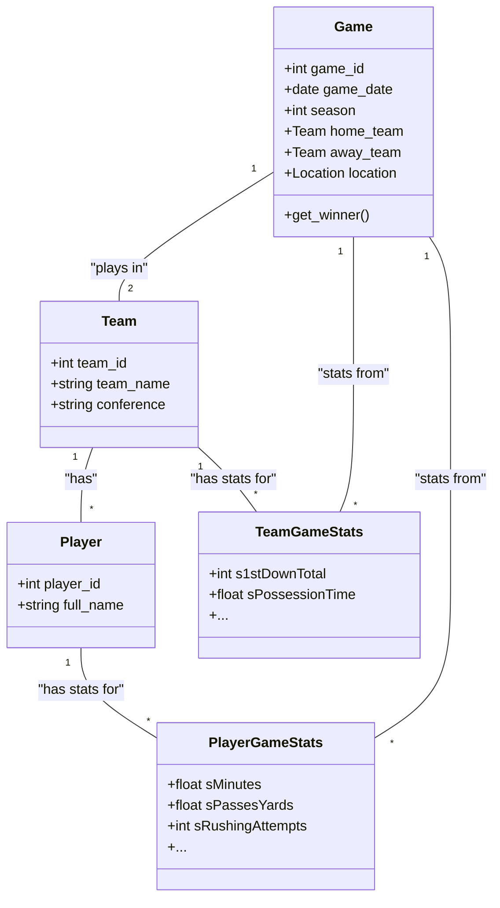

# Data Design Documentation for Football Statistics

## 1. Introduction

This document outlines the data design for a comprehensive football statistics database. The design is derived from the data dictionary provided in `FootballSchemas - Usability.csv`. It aims to create a structured, relational data model that can efficiently store and serve data for a variety of applications, such as sports analytics platforms, media portals, and historical record-keeping.

This document details the high-level architecture, the logical data model with an Entity-Relationship Diagram (ERD), detailed table schemas, and an object-oriented view using a UML Class Diagram.

## 2. High-Level Architecture

The proposed architecture is a standard ETL (Extract, Transform, Load) pipeline that feeds a relational database. This database then serves data to end-user applications via an API.

```mermaid
graph TD
    subgraph Data Sources
        XML_Files[StatCrew XML Files]
        CSV_Dictionary["FootballSchemas - Usability.csv (Data Dictionary)"]
    end

    subgraph Data Processing
        ETL[ETL Pipeline (e.g., Python scripts, Airflow)]
    end

    subgraph Data Storage
        DB[(Relational Database - e.g., PostgreSQL)]
    end

    subgraph Application Layer
        API[Stats API (e.g., REST/GraphQL)]
    end

    subgraph Consumers
        WebApp[Web Application]
        Analytics[Analytics Dashboard]
        MobileApp[Mobile App]
    end

    XML_Files -- "Parsed by" --> ETL
    CSV_Dictionary -- "Informs structure of" --> ETL
    ETL -- "Loads data into" --> DB
    DB -- "Queried by" --> API
    API --> WebApp
    API --> Analytics
    API --> MobileApp
```

*   **Data Sources:** Raw data comes from StatCrew XML files (like `ARK03.XML`). The structure and meaning of the data are defined by the data dictionary.
*   **ETL Pipeline:** A processing layer is responsible for parsing the XML files, cleaning and standardizing the data (e.g., player names, team names), and structuring it according to the schema defined in this document.
*   **Data Storage:** A relational database (like PostgreSQL or MySQL) is used to store the structured data.
*   **Application Layer:** A backend API provides controlled access to the data, allowing various clients to consume it without directly accessing the database.
*   **Consumers:** Different front-end applications can be built on top of the API.

## 3. Data Model & ERD

The data model is designed around core entities in football: **Games, Teams, and Players**. Statistics are captured at different levels of aggregation (game, season, career) for both players and teams.

A **wide table format** is chosen for the statistics tables (`PlayerGameStats`, `TeamGameStats`, etc.). This means each statistic has its own column. This approach is chosen for:
*   **Query Performance:** It avoids complex joins and pivots that would be necessary with a "long" (key-value) format, making it faster for typical analytics queries where multiple stats for a single game or player are required.
*   **Simplicity:** The schema directly maps to the provided data dictionary, making it intuitive to understand.

The main tradeoff is a lack of flexibility; adding a new stat requires altering the table structure (`ALTER TABLE`). Given the relatively static nature of sports statistics, this is an acceptable tradeoff.

### Entity-Relationship Diagram (ERD)

```mermaid
erDiagram
    GAMES {
        int game_id PK
        date game_date
        int home_team_id FK
        int away_team_id FK
        int season
        string location
        string stadium
    }
    TEAMS {
        int team_id PK
        string team_name
        string conference
    }
    PLAYERS {
        int player_id PK
        string player_name
        int current_team_id FK
    }
    PLAYER_GAME_STATS {
        int player_game_stats_id PK
        int player_id FK
        int game_id FK
        int sMinutes
        float sPassesYards
        int sRushingAttempts
        ...
    }
    TEAM_GAME_STATS {
        int team_game_stats_id PK
        int team_id FK
        int game_id FK
        int s1stDownTotal
        float sPossessionTime
        ...
    }
    PLAYER_SEASON_STATS {
        int player_season_stats_id PK
        int player_id FK
        int season
        int sGames
        float sPassesYards
        ...
    }
    TEAM_SEASON_STATS {
        int team_season_stats_id PK
        int team_id FK
        int season
        int sWins
        int sLosses
        ...
    }

    GAMES }o--|| TEAMS : "away_team"
    GAMES }o--|| TEAMS : "home_team"
    PLAYERS }o--|| TEAMS : "plays for"
    PLAYER_GAME_STATS ||--o{ PLAYERS : "stats for"
    PLAYER_GAME_STATS ||--o{ GAMES : "stats in"
    TEAM_GAME_STATS ||--o{ TEAMS : "stats for"
    TEAM_GAME_STATS ||--o{ GAMES : "stats in"
    PLAYER_SEASON_STATS ||--o{ PLAYERS : "stats for"
    TEAM_SEASON_STATS ||--o{ TEAMS : "stats for"
```

## 4. Detailed Table Schema

Below are the detailed schemas for the primary tables in the database. The statistics columns are truncated for brevity but would include all relevant fields from the data dictionary.

---
### **`TEAMS`**
Stores information about each unique team.

```sql
CREATE TABLE TEAMS (
    team_id INT PRIMARY KEY AUTO_INCREMENT,
    team_name VARCHAR(255) NOT NULL UNIQUE,
    conference VARCHAR(255)
);
```

---
### **`PLAYERS`**
Stores information about each unique player.

```sql
CREATE TABLE PLAYERS (
    player_id INT PRIMARY KEY AUTO_INCREMENT,
    full_name VARCHAR(255) NOT NULL,
    current_team_id INT,
    FOREIGN KEY (current_team_id) REFERENCES TEAMS(team_id)
);
```

---
### **`GAMES`**
Stores metadata for each game.

```sql
CREATE TABLE GAMES (
    game_id INT PRIMARY KEY AUTO_INCREMENT,
    game_date DATE NOT NULL,
    season INT NOT NULL,
    home_team_id INT NOT NULL,
    away_team_id INT NOT NULL,
    location VARCHAR(255),
    stadium VARCHAR(255),
    FOREIGN KEY (home_team_id) REFERENCES TEAMS(team_id),
    FOREIGN KEY (away_team_id) REFERENCES TEAMS(team_id)
);
```

---
### **`PLAYER_GAME_STATS`**
Stores game-level statistics for each player. This table is based on the "Player Game Statistics" column in the data dictionary.

```sql
CREATE TABLE PLAYER_GAME_STATS (
    player_game_stats_id INT PRIMARY KEY AUTO_INCREMENT,
    player_id INT NOT NULL,
    game_id INT NOT NULL,
    -- General Stats
    sMinutes FLOAT,
    -- Passing Stats
    sPassesAttempted INT,
    sPassesCompleted INT,
    sPassesYards FLOAT,
    sPassesTouchdowns INT,
    sPassesIntercepted INT,
    sPassesLongest INT,
    -- Rushing Stats
    sRushingAttempts INT,
    sRushingYardsNet FLOAT,
    sRushingTouchdowns INT,
    sRushingLongest INT,
    -- ... and so on for all player-game level stats from the dictionary
    FOREIGN KEY (player_id) REFERENCES PLAYERS(player_id),
    FOREIGN KEY (game_id) REFERENCES GAMES(game_id),
    UNIQUE (player_id, game_id)
);
```

---
### **`TEAM_GAME_STATS`**
Stores game-level statistics for each team.

```sql
CREATE TABLE TEAM_GAME_STATS (
    team_game_stats_id INT PRIMARY KEY AUTO_INCREMENT,
    team_id INT NOT NULL,
    game_id INT NOT NULL,
    s1stDownTotal INT,
    s3rdDownConversions INT,
    s3rdDownAttempts INT,
    s4thDownConversions INT,
    s4thDownAttempts INT,
    sPossessionTime FLOAT,
    sTurnovers INT,
    -- ... and so on for all team-game level stats
    FOREIGN KEY (team_id) REFERENCES TEAMS(team_id),
    FOREIGN KEY (game_id) REFERENCES GAMES(game_id),
    UNIQUE (team_id, game_id)
);
```

---
### **`PLAYER_SEASON_STATS`**
Stores aggregated season-level statistics for each player.

```sql
CREATE TABLE PLAYER_SEASON_STATS (
    player_season_stats_id INT PRIMARY KEY AUTO_INCREMENT,
    player_id INT NOT NULL,
    season INT NOT NULL,
    sGames INT,
    -- Aggregated stats from the dictionary...
    sPassesYards FLOAT,
    sRushingYardsNet FLOAT,
    FOREIGN KEY (player_id) REFERENCES PLAYERS(player_id),
    UNIQUE (player_id, season)
);
```

---
## 5. UML Class Diagram

This diagram shows the main data entities as classes, with their attributes and relationships. It provides an object-oriented perspective of the data model.



## 6. Data Dictionary

This section summarizes the statistics defined in the `FootballSchemas - Usability.csv` file, grouped by category.

### Offense
*   **First Down:** s1stDownAttempts, s1stDownConversions, sFirstDownPassing, sFirstDownPenalty, sFirstDownRushing, sFirstDownTotal
*   **Third Down:** s3rdDownAttempts, s3rdDownConversionPassing, s3rdDownConversionPenalty, s3rdDownConversionRushing, s3rdDownConversions
*   **Fourth Down:** s4thDownAttempts, s4thDownConversionPassing, s4thDownConversionPenalty, s4thDownConversionRushing, s4thDownConversions
*   **Passes:** sPassEfficiency, sPasses, sPassesAverageYardsPerCompletion, sPassesCompleted, sPassesIntercepted, sPassesLongest, sPassesPercentage, sPassesTouchdowns, sPassesYards, sPassesYardsPerAttempt, sPassesYardsPerCatch
*   **Receiving:** sReceptions, sReceptionsAverage, sReceptionsLongest, sReceptionsTouchdown, sReceptionsYards
*   **Rushing:** sRushingAttempts, sRushingLongest, sRushingNetYardsAverage, sRushingTouchdowns, sRushingYardsGain, sRushingYardsLoss, sRushingYardsNet
*   **Red Zone:** sRedZoneAttempts, sRedZoneMade, sRedZonePoints, sRedZoneTouchdownsRushes, sRedZoneTouchdownsReceptions
*   ... and other offensive stats.

### Defense
*   **Tackles:** sTacklesAssisted, sTacklesForLossTotal, sTacklesSolo, sTacklesTotal, sTacklesYards
*   **Sacks:** sSacksAssisted, sSacksTotal, sSacksUnassisted, sSacksYards
*   **Interceptions:** sInterceptionsAverage, sInterceptionsReturnLongest, sInterceptionsReturnYards, sInterceptionsTouchdowns
*   **Fumbles:** sFumblesForced, sFumblesLost, sFumblesRecovered, sFumbleReturnTouchdowns, sFumbleReturnYards
*   ... and other defensive stats.

### Special Teams
*   **Field Goal (FG):** sFieldGoalAttempts, sFieldGoalsMade, sFieldGoalsBlocked, sFieldGoalMadeLongest
*   **Punts:** sPunts, sPuntsAverage, sPuntsLongest, sPuntsInside20, sPuntsBlocked
*   **Punt Return:** sPuntReturns, sPuntReturnsAverage, sPuntReturnsLongest, sPuntReturnsTouchdown, sPuntReturnsYards
*   **Kickoff:** sKickoffs, sKickoffsTouchbacks, sKickoffsOutOfBound
*   **Kick Return:** sKickReturnsTotal, sKickReturnsAverage, sKickReturnsLongest, sKickReturnsTouchdowns, sKickReturnsYards
*   **PATs:** sPatAttempts, sPatMade, sPatKicksAttempted, sPatKicksMade, sPatKicksBlocked
*   ... and other special teams stats.

